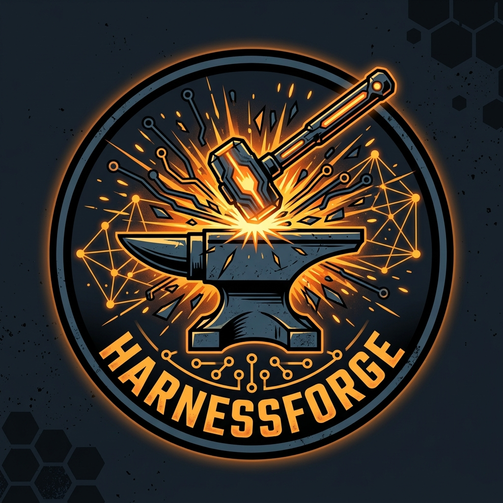

# ⚡ HarnessForge

<div align="center">



### **Forge your autonomous agents with deterministic precision.**

*Visual state-graph & loop engineering for autonomous AI agents directly on localhost.*  
*No cloud lock-in. No vendor lock-in. Deterministic control.*

[](file:///home/peppi/coding/Harnessforge/backend)
[](file:///home/peppi/coding/Harnessforge/frontend)
[-f59e0b?style=flat-square)](file:///home/peppi/coding/Harnessforge/docs/adr/ADR-001-vsa-modular-monolith.md)
[](file:///home/peppi/coding/Harnessforge/docs/PLAN.md)
[](file:///home/peppi/coding/Harnessforge)

</div>

---

## 🧭 What is HarnessForge?

**HarnessForge** is a local-first, low-code/no-code developer platform that enables engineers to visually design, execute, observe, and debug complex **AI Agent Harnesses** (scaffoldings) directly in the browser, and export them with a single click into **standalone, production-grade Python code (`agent_runner.py`)**.

Unlike generic automation tools or opaque cloud wrappers, HarnessForge is purpose-built for **Loop Engineering**, **Graph Engineering**, **Local Vector RAG (LanceDB)**, **State Reducers / Set Variable nodes**, and **Local Prompt Bindings (`agents.md`)**.

```
+------------------------------------------------------------------------------------+
|                                    HARNESSFORGE                                    |
|                                                                                    |
|  [ File Explorer ]  [ Canvas: React Flow + Custom Nodes ]   [ Live Inspector ]    |
|  - agents.md        ┌───────────┐    ┌──────────────┐       - Node Config         |
|  - prompts/         │ RAG Node  ├───►│ LLM Call     ├─┐     - State Diff          |
|  - lancedb/         │ (LanceDB) │    │ (agents.md)  │ │     - Token Counter       |
|  - tools/           └───────────┘    └──────▲───────┘ │     - Dataflow Approval   |
|                                             │         ▼                           |
|                                       ┌─────┴───────────┐                         |
|                                       │ Loop / Router   │◄─── [ Set Variable ]    |
|                                       │ (Max 5 Steps)   │                         |
|                                       └────────┬────────┘                         |
|                                                ▼                                  |
|                                       ┌─────────────────┐                         |
|                                       │ Output / Export │                         |
|                                       └─────────────────┘                         |
|  [ Bottom Drawer: Live Trace | Token Radar | Tool Output | Run History ]          |
+------------------------------------------------------------------------------------+
```

---

## ✨ Key Features

### 🎨 Visual Flow Canvas (Neural Forge Theme)
* **React Flow (XYFlow) Engine:** Smooth drag-and-drop, zoom, pan, fit-to-view, interactive minimap, and keyboard shortcuts (`Ctrl+Z`, `Ctrl+Y`, `Delete`, `Ctrl+D`).
* **Specialized Node Registry:**
  * **`Start Node`**: Graph entry point with input schema and default task queries.
  * **`LLM Call Node`**: Configurable inference step with prompt templates, bindings, and multi-model support (Ollama, Mistral AI, Anthropic Claude 5, OpenAI GPT-5.6, Google Gemini 3).
  * **`RAG / LanceDB Node`**: Read-only local `.lance` vector search with top-k scoring and table presets.
  * **`Loop / Router Node`**: Visual ReAct and reflection cycles with declarative conditions (`equals`, `regex`, `number`, `exists`), hard iteration caps, and designated fallback routes.
  * **`Set Variable (State) Node`**: n8n-style state mutation node supporting `SET`, `APPEND_LIST`, `MERGE_DICT`, and `INCREMENT`.
  * **`Tool Node`**: Executes local CLI scripts and Python tools in transparent **Local Trust Mode** with timeout and byte output caps.
  * **`Output Node`**: Validated terminal state delivering formatted markdown or JSON.
* **Dynamic Node Status Glows:** Real-time visual feedback (`Amber Pulse` for running, `Emerald` for success, `Crimson` for errors).

### 🤖 AI Agent Architect (Prompt-to-Graph Builder)
* Synthesize complete, runnable agent graphs directly from natural language prompts.
* Powered by native **Mistral AI (`codestral-latest`, `mistral-large-latest`, `mistral-small-latest`)** or local **Ollama** inference with intelligent fallback graph synthesis.
* Pre-configured starter templates for **Minimal ReAct Loop**, **LanceDB RAG QA**, and **Self-Healing Coding Agent**.

### 🐍 1-Click Standalone Python Export (Zero Runtime Lock-in)
* Export your entire agent graph into a **single, self-contained Python script (`agent_runner.py`)**.
* Zero dependencies on FastAPI, React, or HarnessForge servers at runtime.
* Includes `argparse` CLI, stdout event streaming, structured JSON logging, clean exit codes, and `--dry-run` validation.
* Automatically bundles pinned `requirements.txt` and `.env.example`.

### 🛡️ Enterprise Security Architecture (CodeUltra Standards)
* **Strict Loopback Binding:** Backend binds exclusively to `127.0.0.1` with a per-process cryptographic Session Token and Host/Origin header validation.
* **Workspace Boundary Enforcement:** All file paths are strictly resolved through `WorkspaceBoundary`; path traversal (`..`), symlink escapes, and unauthorized directories are rejected.
* **Secrets Vault & Restricted Permissions:** API keys are stored in `.env` with strict **`chmod 0600`** (owner-only) POSIX permissions and masked on all client requests.
* **Explicit Cloud Dataflow Approval:** Granular opt-in confirmation before sending state variables to external cloud providers.
* **Local Trust Mode for Subprocesses:** Tools run as hash-verified subprocesses with execution timeouts and bounded memory buffers.

### 📊 Live Observability & Token Radar
* **WebSocket Realtime Streaming:** Live telemetry for node states, streaming tokens, tool stdout/stderr, and loop counters.
* **Token Radar:** Dynamic visual breakdown of context window consumption (system prompts, RAG context, tool logs, chat history).
* **Local SQLite Store:** Audit trail and execution logs persisted in `.harnessforge/runs.db` (WAL mode) with configurable retention.

---

## 🏗️ Architecture & Technology Stack

HarnessForge is designed as a **Modular Monolith following Vertical Slice Architecture (VSA)**:

```text
Harnessforge/
├── assets/                             # Brand assets & logos (Neural Forge Emblem)
├── backend/
│   ├── app/
│   │   ├── core/                       # Shared primitives: Config, Security, DB
│   │   └── features/                   # Independent vertical feature slices
│   │       ├── graph_authoring/        # .forge.json schema, validator & AI builder
│   │       ├── execution/              # Async graph interpreter & loop governance
│   │       ├── providers/              # Mistral, Anthropic, OpenAI, Ollama adapters & settings
│   │       ├── retrieval/              # LanceDB read-only RAG & query runner
│   │       ├── tool_execution/         # Subprocess runner & Local Trust Mode
│   │       ├── human_gates/            # Interactive approval gates
│   │       ├── time_travel/            # Checkpoint & state time-travel debugger
│   │       ├── rlm/                    # Recursive Language Model spawner
│   │       ├── observability/          # WebSocket event broker & SQLite run store
│   │       └── export/                 # Standalone agent_runner.py generator
│   ├── tests/                          # 330 automated Pytest test suites
│   └── run.py                          # Supported loopback launcher (127.0.0.1:8000)
├── frontend/
│   ├── src/
│   │   ├── app/                        # Main shell, toolbar & layout
│   │   ├── shared/                     # Theme tokens, UI components, session auth
│   │   └── features/                   # Feature slices (Canvas, Inspector, Settings, Drawer)
│   └── package.json                    # Vite + React + TypeScript + XYFlow
├── templates/
│   └── standalone_runner.py.jinja      # Jinja2 template for standalone Python export
├── docs/                               # Architecture ADRs, specifications & PLAN.md
├── CONTEXT.md                          # Domain vocabulary & system invariants
├── task.md                             # Master task board
└── Erweiterungen.md                    # Phase-2 roadmap (RLM, REPL, MCP)
```

---

## 🚀 Quickstart (Local Setup)

### Prerequisites
* **Python 3.11+** and [uv](https://docs.astral.sh/uv/) (recommended) or `pip`
* **Node.js 20+** and `npm`
* *(Optional)* Local [Ollama](https://ollama.com/) instance for offline inference

### 1. Launch the Backend
```bash
cd backend
uv sync
python run.py
```
> The backend will start on `http://127.0.0.1:8000` and automatically output its session token.

### 2. Launch the Frontend
```bash
cd frontend
npm install
npm run dev
```
> Open `http://localhost:5173` in your browser.

---

## 🧪 Running Tests

Every layer of HarnessForge is verified through comprehensive automated test suites:

```bash
# Run backend tests (330 Pytest tests covering security, VSA boundaries & execution)
cd backend && uv run pytest -q

# Run frontend tests (80 Vitest component, store & security tests)
cd frontend && npm test -- --run

# Validate frontend production bundle
cd frontend && npm run build
```

---

## 📖 Documentation & Architecture References

* [CONTEXT.md](CONTEXT.md) — Domain vocabulary, system terms, and invariants.
* [docs/PLAN.md](docs/PLAN.md) — 8-phase implementation plan and CodeUltra compliance.
* [docs/adr/](docs/adr/) — Architecture Decision Records (ADR-001 through ADR-007).
* [task.md](task.md) — Master implementation task board.
* [Erweiterungen.md](Erweiterungen.md) — Phase-2 roadmap (RLM Prime-Agent patterns, Python REPL sandbox, MCP Gateway, Time-Travel debugger).

---

## 📄 License

MIT License — Built with precision for autonomous agent engineers.  
*Forge your autonomous agents with deterministic precision.*
